# Creación de un entorno de ejecucion por medio de Azure Machine Learning

Con esta practica aprenderemos a usar este recurso disponible en Azure, que permite crear inteligencias artificiales.

**Requisitos**

--Tener acceso a una cuenta y suscripcion de azure

**Procedimiento**

1- Abrir en el navegador de internet el [portal de Azure](portal.azure.com)

2- En el buscador escribir "Azure Machine Learning" y seleccionar la primera opcion

3- Ya en su ventana de recursos solo buscamos el boton de crear

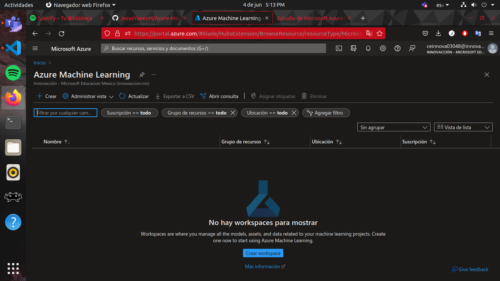

4- Ya solo es nesesario especificar lo minimo para crear un recurso, que es; grupo de recursos, region, suscripcion y nombre del recurso. Ya solo presionamos en revisar y crear para que valide la solicitud

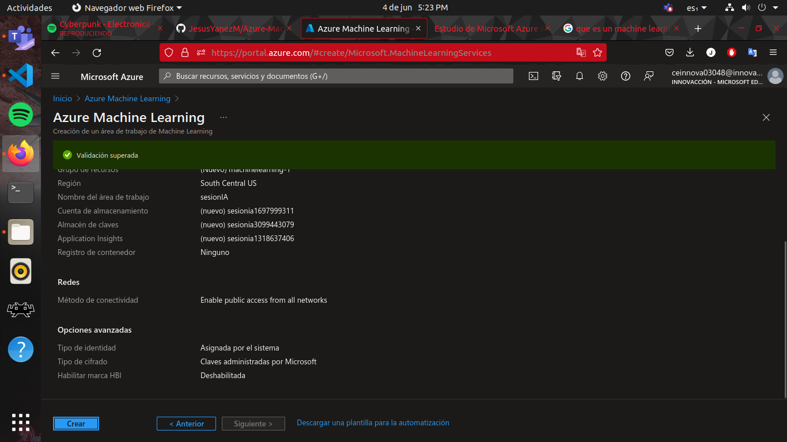

4- Presionamos en crear y esperamos a que termine el proceso

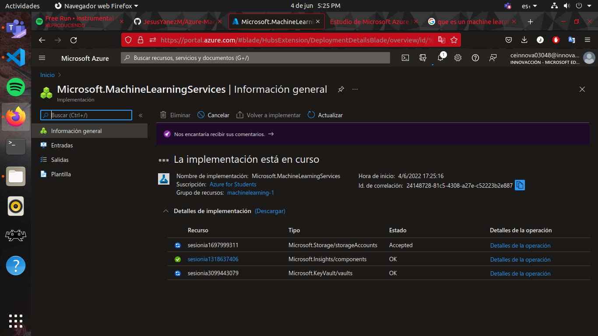

**Nota:** por crear areas de trabajo como lo que acabamos de hacer no se cobra

5- Una vez creada el area de trabajo, entraremos a la siguiente direccion electronica para poder trabajar con una notebook, [ml.azure.com] y entraremos al area de trabajo que recien creamos.

**Nota** Para administrar y abrir las instancias de programacion se debe hacer desde esa pagina (basicamente es una maquina virtual dedicada solo a la ejecucion de codigo)

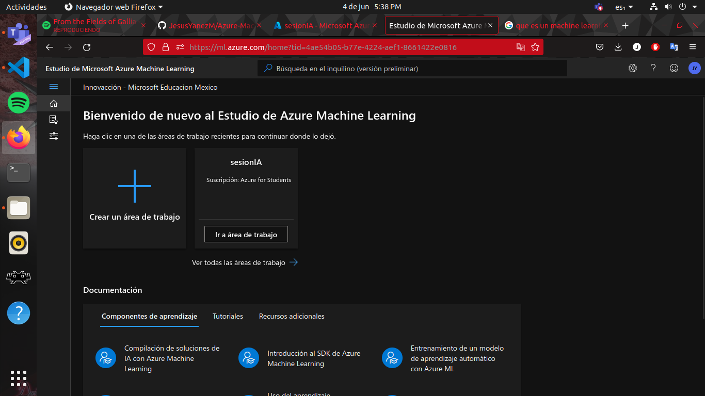

6- En el panel de la parte izquierda de la pantalla esta el menu para administrar y configurar los recursos. Buscaremos y precionaremos el boton de Procesos

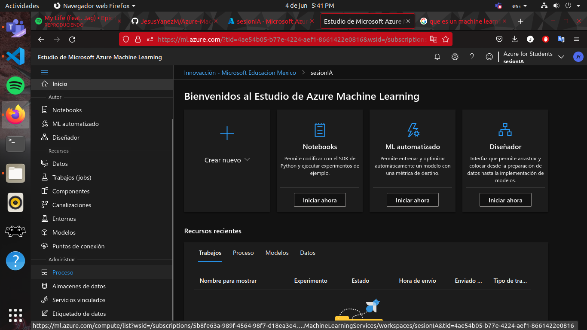

7- En la ventana que se abre en la parte sentral buscamos el boton de nuevo o nueva instancia

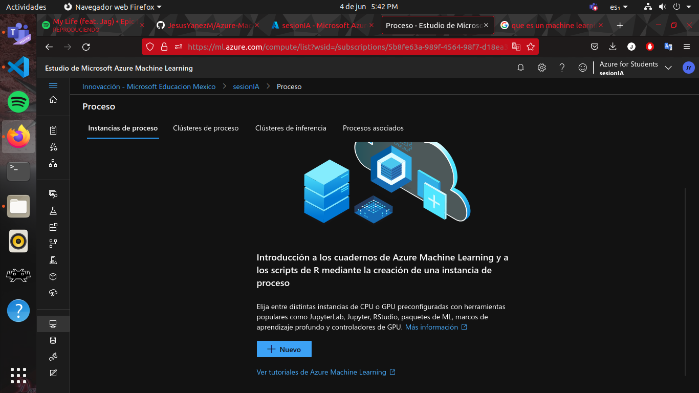

8- Nombramos la instancia y escogemos el plan de cobro que mas nos convenga

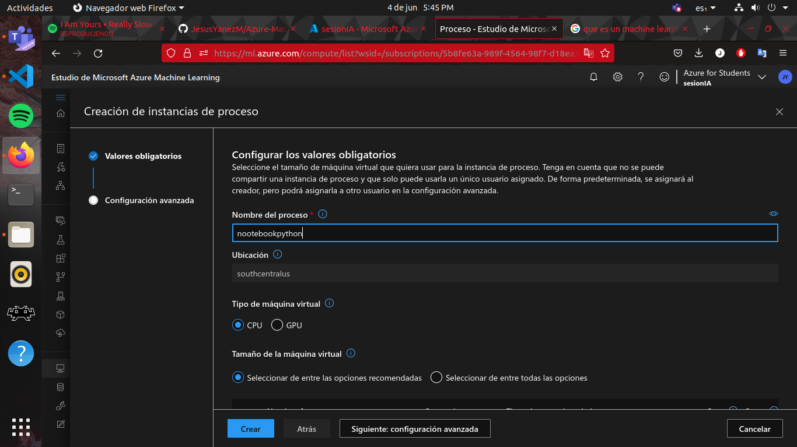

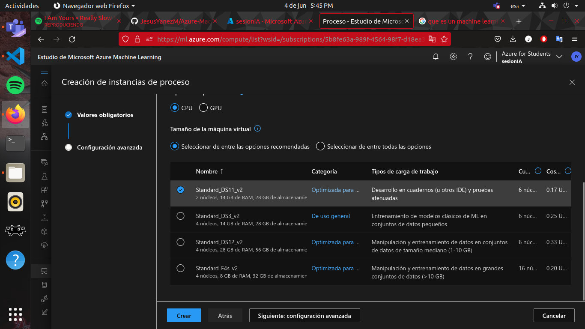

9- Ya solo esperamos a que se cree la instancia

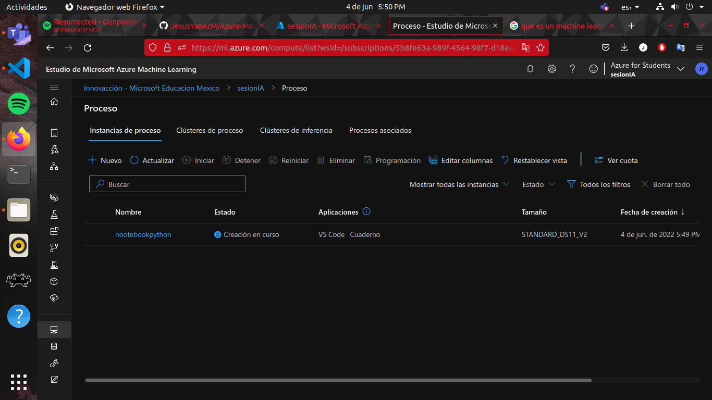

10- Cuando termine de crearse, en el menu de la izquierda buscaremos la obcion de Notebook

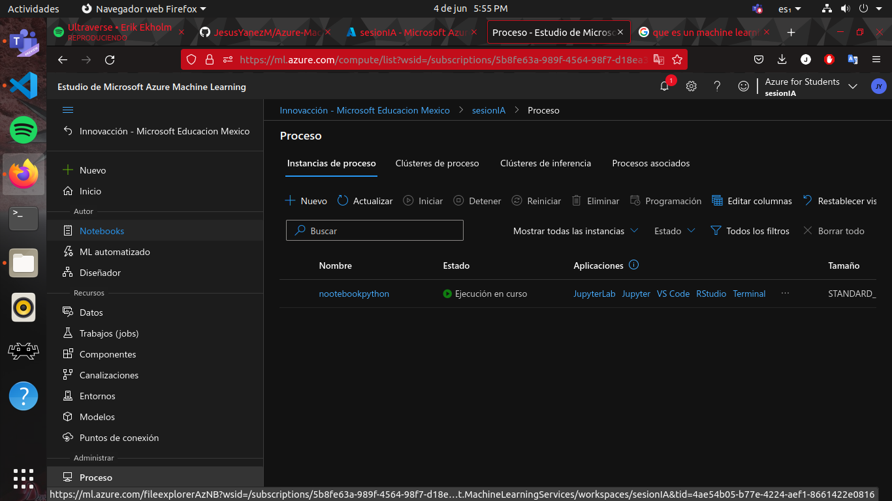

**Nota:** este tipo de instancias cobran por hora

11- Se abrira la siguiente ventana donde deberas seleccionar la carpeta con tu nombre o correo, y crear un nuevo archivo con el nombre de hola mundo sin cambiar ningun parametro

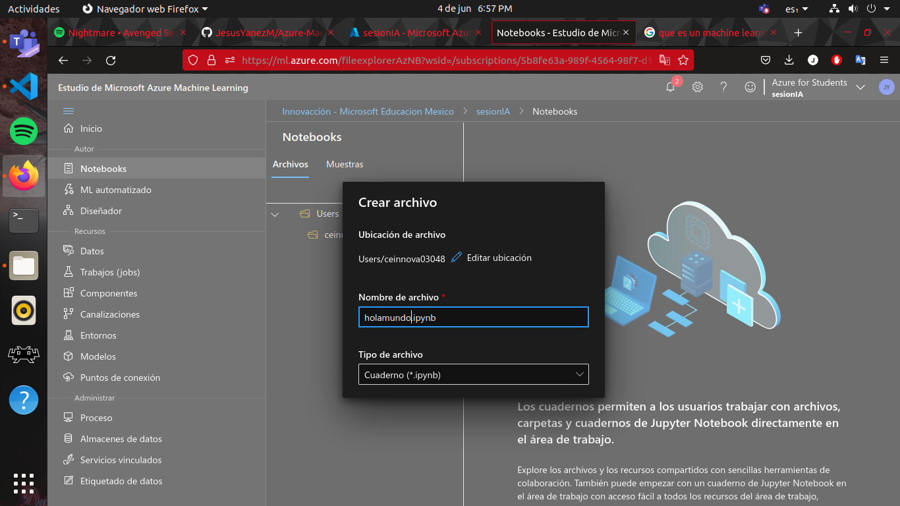

12- Y asi es como se crea un entorno de ejecucion para programar, con ayuda de Azure machine learning

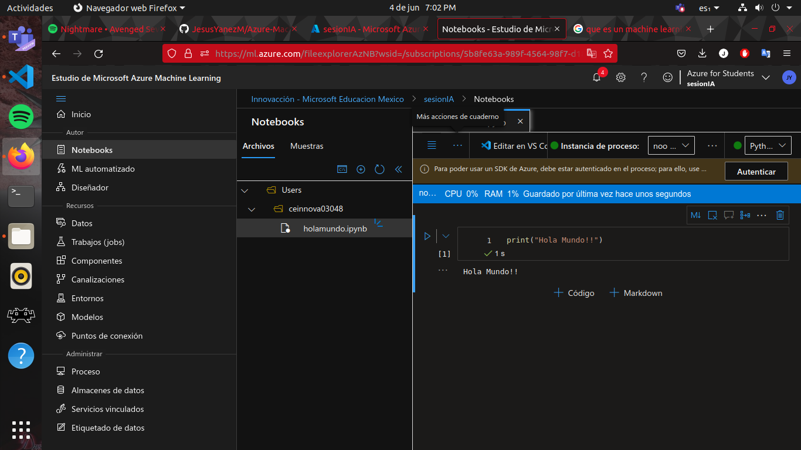

**Nota:** Para detener la instancia solo es necesario dirigirnos al menu de la parte izquierda, seleccionar la opcion de procesos y maracar la instancia que deseamos detener, depues presionamos el boton de detener y listo